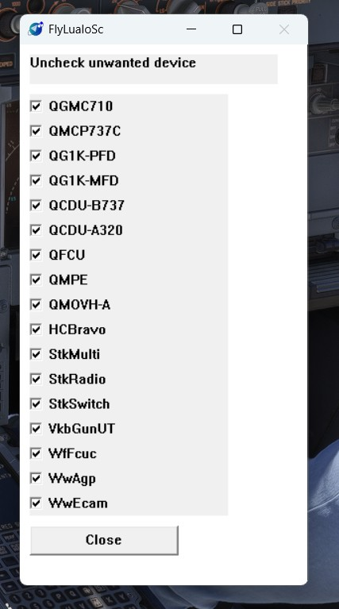

# flyluaiosc
Use Lua to control flight simulation USB HID hardware I/O

flyluaiosc stands for flyluaio Sim Connect for MSFS2020 and MSFS2024

flyluaiosc.exe is a standalone application runs on Windows OS

# Features

*   **Real-Time Add Device**: Json + Lua is a new USB HID Device without compiling code
*   **Zero Performance Impact**: Absolutely Zero impact on game frame rates (FPS).
*   **Built-in Lua Language Engine**: Simple to use and easy to customize.
*   **Easy Debugging**: Automatically reload Lua scripts After Editing the Lua file, speeding up the debugging process.
*   **JSON defined USB HID**: Add Json, add a USB HID Device
*   **Automatic Flight Device Key Assignment**: Say goodbye to the pain of manually setting hundreds of keys.
*   **Smooth Aircraft Switching**: Say goodbye to the hassle of searching the entire internet for configuration files.   

# Game/Hardware Compatibility List

## Hardware
- Honeycomb Bravo
- Saitek Multi Panel
- Saitek Radio Panel
- Saitek Switch Panel
- WinWing/WinCtrl AGP
- WingFlex Cube
- VKBsim Gunfighter MCG Ultimate Twist
- Quickmadesim QGMC710, QMCP737C, QG1K, QFCU, QCDU, QMPE, QMOVH-A
- Adding ... (Json + Lua is a new USB HID device) 

Please check the detailed compatibility list via the following link:
[Device Game Compatibility List](https://docs.qq.com/sheet/DWERFQnRmVUFZeHBi?tab=000001)

# Settings

if you don't want FlyLuaIoSc to control your hardware, here is the list you can uncheck them

